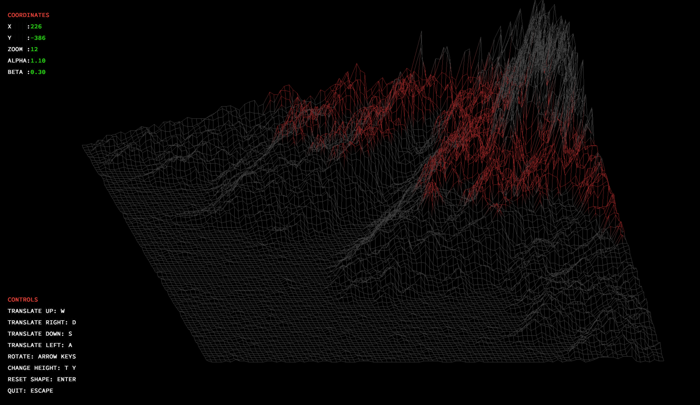

<h1 align="center">Project Title: FDF (Wireframe model)</h1>

<div align="center">
	
</div>

## Overview:
The FDF project revolves around creating a wireframe model to represent a landscape in 3D. This involves rendering the landscape using isometric projection and managing graphics to display the model in a window. The project is implemented in C and utilizes the MiniLibX library for graphical operations.

## Skills Needed:
- Proficiency in C programming language.
- Understanding of graphics programming concepts.
- Familiarity with MiniLibX library for graphical operations.
- Ability to parse input files and process data efficiently.
- Skill in implementing smooth window management, including minimizing and closing windows cleanly.
- Knowledge of handling keyboard and mouse events.
- Utilization of mathematical functions for transformations and projections.
- Experience in managing memory allocation and freeing allocated memory to avoid memory leaks.

## Wireframes:
The project involves rendering a landscape represented by points in space, with each point having coordinates (x, y, z). The landscape is stored in a .fdf file, where each number represents a point's position and altitude. The FDF program reads this file and renders the landscape using isometric projection. Here's an example of how the landscape is represented in a .fdf file:

```
0 0 0 0 0 0 0 0 0 0 0 0 0 0 0 0 0 0 0
0 0 0 0 0 0 0 0 0 0 0 0 0 0 0 0 0 0 0
0 0 10 10 0 0 10 10 0 0 0 10 10 10 10 10 0 0 0
0 0 10 10 0 0 10 10 0 0 0 0 0 0 0 10 10 0 0
0 0 10 10 0 0 10 10 0 0 0 0 0 0 0 10 10 0 0
0 0 10 10 10 10 10 10 0 0 0 0 10 10 10 10 0 0 0
0 0 0 10 10 10 10 10 0 0 0 10 10 0 0 0 0 0 0
0 0 0 0 0 0 10 10 0 0 0 10 10 0 0 0 0 0 0
0 0 0 0 0 0 10 10 0 0 0 10 10 10 10 10 10 0 0
0 0 0 0 0 0 0 0 0 0 0 0 0 0 0 0 0 0 0
0 0 0 0 0 0 0 0 0 0 0 0 0 0 0 0 0 0 0
```

## Detailed Description:
The FDF project tasks students with creating a wireframe model of a landscape, offering an excellent introduction to computer graphics programming. The landscape is represented by a grid of points, where each point has coordinates (x, y, z) indicating its position and altitude. These points are connected to form lines, creating a wireframe representation of the landscape.

The project specifications require rendering the wireframe model using isometric projection, which provides a three-dimensional representation without perspective distortion. Students need to implement algorithms to transform 3D coordinates into 2D screen coordinates for display.

Additionally, the project involves managing graphics to display the wireframe model in a window using the MiniLibX library. Students must ensure smooth window management, including handling events such as minimizing and closing windows. Keyboard and mouse events should also be managed to provide user interaction with the model.

The project emphasizes efficient file parsing to read the landscape data from a .fdf file. Students are encouraged to utilize functions from their custom library (libft) for file I/O operations and memory management.

## References

[Wikipedia For matrix calculations](https://en.wikipedia.org/wiki/Matrix_(mathematics))

[Essence of linear algebra by 3blue1brown](https://www.youtube.com/watch?v=fNk_zzaMoSs&list=PLZHQObOWTQDPD3MizzM2xVFitgF8hE_ab)

## Conclusion:
The FDF project provides an immersive learning experience in graphics programming, offering students the opportunity to apply fundamental concepts to create a visually engaging wireframe model of a landscape. Through hands-on implementation and problem-solving, students develop essential skills in C programming, graphics programming, and algorithmic thinking.

> **_NOTE:_**  For some reason mlx may not work in the docker container, if that happens and you're on linux all the packages needed are in available in the dockerfile.
